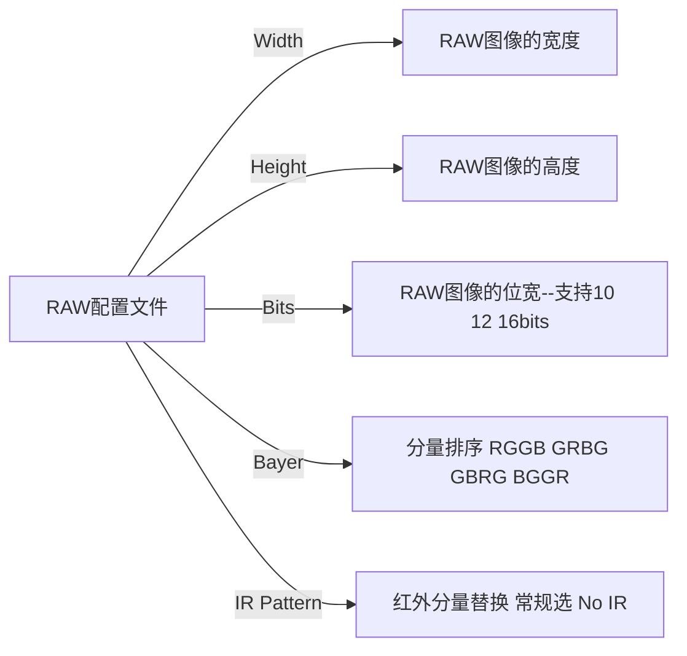
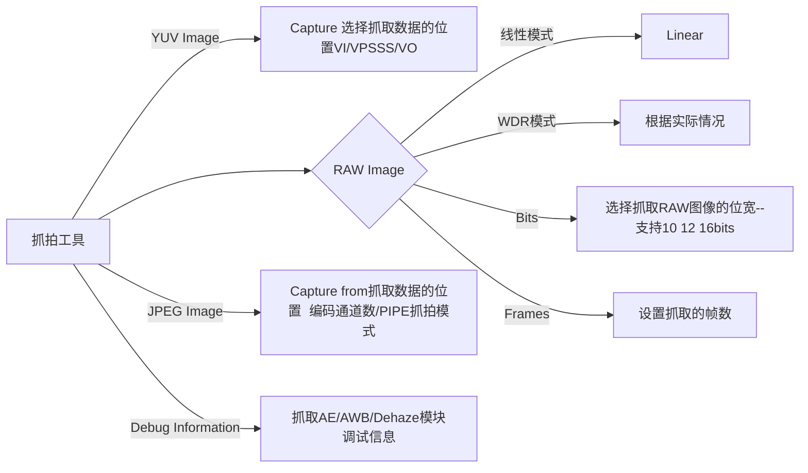

#  RAW数据的基本属性

####   设置基本属性：

​		

==ISP标定工具：最左侧栏框为需要导入的Raw数据，右边最上方为设置RAW的基本属性及BLC参数设定，中间框架为各个算法工作区域==。

```mermaid
graph LR
	A[RAW配置文件] -->|Width| B[RAW图像的宽度 ]
	A-->|Height| C[RAW图像的高度]
	A -->|Bits| D[RAW图像的位宽--支持10 12 16bits]
	A -->|Bayer| E[分量排序 RGGB GRBG GBRG BGGR]
	A -->|IR Pattern| F[红外分量替换 常规选 No IR]
	
```

 ####   抓取RAW数据

==1、3、4、==图像抓拍区域

==2、==Debug信息抓拍区

```mermaid
graph LR
	A[抓拍工具] -->|YUV Image| B[Capture 选择抓取数据的位置VI/VPSSS/VO]
	
	A-->C{RAW Image}
	C-->|线性模式| K[Linear]
	C-->|WDR模式| G[根据实际情况]
	C -->|Bits| D[选择抓取RAW图像的位宽--支持10 12 16bits]
	C-->|Frames| E[设置抓取的帧数]
	
	A -->|JPEG Image| F[Capture from抓取数据的位置  编码通道数/PIPE抓拍模式]

	A-->|Debug Information| Q[抓取AE/AWB/Dehaze模块调试信息]
	
	

```

`

